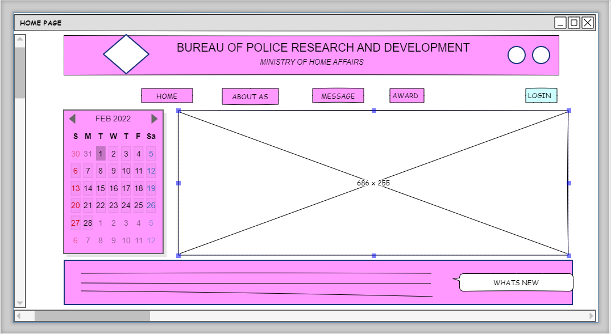
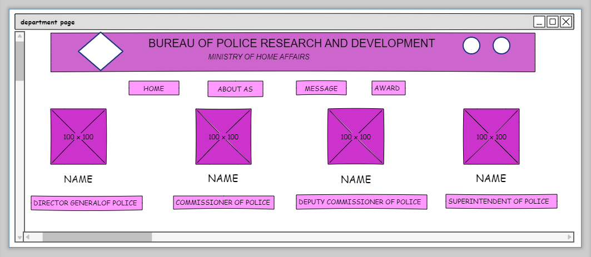
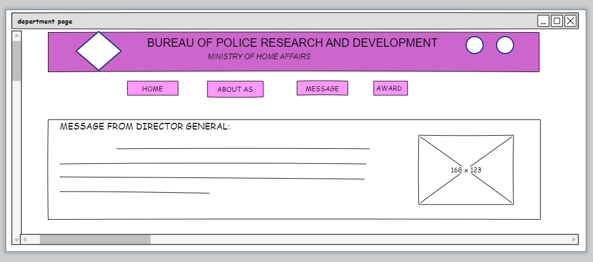

# Wire frame for a website

## AIM:
To design a wire frame work for a website

## DESIGN STEPS:

### Step 1:
 Create a New document.

### Step 2:
Resize Canvas with dimension of 1024 as width and 768 height.

## step 3 :
Use the given web elements to design the wireframe of a website .

## step 4:
Using "Link to" option link hyperlink,button with other pages.

## step 5:
Save the document and export the file as Single web page with Clickable Prototype HTML Template.

## OUTPUT:

## HOME PAGE:

## ABOUT US :

## MESSAGE :

## Result:
Thus a wire frame is designed for a given website.
